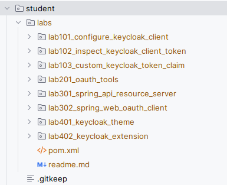

Spring Keycloak Training Materials
---

# Environment

The training environment contains the following services:

| Service                    | Port(s)                                                            | URL                        | Purpose                               |
|----------------------------|--------------------------------------------------------------------|----------------------------|---------------------------------------|
| Keycloak                   | 9090 (HTTP), 9443 (HTTPS), 9000 (Management), 18787 (Remote Debug) | http://localhost:9090/auth | OAuth Authorization Server            
 /OpenID Provider           |
| API                        | 8090 (HTTP)                                                        | http://localhost:8090/     | Example API Resource Server           |
| Web                        | 8080 (HTTP)                                                        | http://localhost:8080/     | Example OpenID Connect RP Classic Web 
| BFF                        | 8070 (HTTP)                                                        | http://localhost:8070/bff/ | Example OpenID Connect RP             
 Backend-for-Frontend (BFF) |
| Gateway                    | 8050 (HTTP)                                                        | http://localhost:8050/     | Example API Gateway                   |
| Postgresql                 | 55432                                                              | -                          | Database                              |
| Mail                       | 1025 (SMTP), 1080 (HTTP)                                           | -                          | Mail Catcher                          |
| Redis                      | 6379                                                               | -                          | Spring Session Cache Backend          |
| Apache HTTPD               | 9080                                                               | http://localhost:9080/spa  | Web Server with SPA Example App       |

# Build

Note: It is VERY important to build the environment first. Otherwise you might need to remove dangling files,
e.g. `./keycloak/extensions/target/extensions.jar`.


```
mvn clean verify
```

# Start

To start the example environment run the following command in the root directory of this project.

```bash
java start.java
```

## Keycloak

The Keycloak Admin console can be accessed via [Keycloak Admin Console (local)](http://localhost:9090/auth/admin).

Keycloak URL: http://localhost:9090/auth

### User Accounts

The following user account can be used to access the admin console:
> *Admin Account*
> - Username: admin
> - Password: admin

The following user accounts can be used for testing:
> *User Account*
> - Username: user
> - Password: user

> *Support Account*
> - Username: support
> - Password: support

The realm in the Keycloak environment is configured via configuration as code with the
tool [keycloak-config-cli](https://github.com/adorsys/keycloak-config-cli).

The realm configuration is applied after Keycloak has started. To apply the realm configuration to a running Keycloak
environment
you can run the following command in the root directory of this project.

```bash
java update.java
```

## Mail

The local mail catcher can be reached via: http://localhost:1080/mail

# Prerequisites

To make the best out of the workshop, the following prerequisites are required:

- Notebook (at least 16 GB RAM)
- Internet Access (Mobile Data or Wifi)
- Current Java 21 installed
- Current Maven Installed (e.g. 3.9.x)
- Current Docker installed (docker compose version should work)
- Git installed
- Current Java IDE installed (IntelliJ, Eclipse, etc., IntelliJ preferred)
- A current HTTP-Client, e.g. PostMan or IDE extensions (e.g. VS Code REST Client extension)
- `curl` installed (https://curl.se/)
- `jq` installed (https://jqlang.github.io/jq/)
- Current Browser (Firefox, Chrome, Edge)

To further speed up the labs, you can optionally do the following:

> Preload Docker images

```bash
docker pull quay.io/keycloak/keycloak:25.0.6
docker pull postgres:16.3
docker pull quay.io/adorsys/keycloak-config-cli:latest-25
docker pull maildev/maildev:2.1.0
docker pull redis:6.2.6-alpine3.15
```

> Prefill maven cache with Spring Boot 3.3 Artifacts  
> To do so, download the
>
following [dummy spring app from the start.spring.io](https://start.spring.io/#!type=maven-project&language=java&platformVersion=3.3.0&packaging=jar&jvmVersion=21&groupId=com.example&artifactId=spring-keycloak-training-cache-warmer&name=spring-keycloak-training-cache-warmer&description=Demo%20project%20for%20Spring%20Boot&packageName=demo&dependencies=web,devtools,lombok,security,oauth2-client,oauth2-resource-server,session,actuator,thymeleaf,cloud-gateway)
> Website.
> Download and extract the project zip to some folder.
> Then run `mvn clean verify -DskipTests` in the project directory.
> You can delete the demo project afterwards.

# Contents

## Keycloak Customizations

The [keycloak](./keycloak) folder contains all customizations we want to add to Keycloak.

* Custom *realm configuration as code* can be found in [keycloak/realms](./keycloak/realms).
* Custom *themes* for login, account, email can be found in [keycloak/themes](./keycloak/themes).
* Custom *Keycloak extensions* can be found in [keycloak/extensions](./keycloak/extensions).

## OIDC / OAuth Example requests

> The [requests](./requests) folder contains a few http client based example requests for some OAuth flows.

## Example Applications

> This project contains the following Spring Boot based example applications:

- [API](./apps/api) which acts as a OAuth Resource Server.
- [WEB](./apps/web), a Classic Web App that acts as an OpenID Connection relying party client with the Code Flow + PKCE.
- [BFF](./apps/bff), a Spring Boot web app that implements the Backend-for-Frontend (BFF) pattern with Spring OAuth
  Client and Spring Session.
- [Gateway](./apps/gateway), a Spring Boot App that uses Spring Cloud Gateway and acts as a Resource Server and OAuth
  Client
- [CLI](./apps/cli), a Command-line interface (CLI) Spring Boot App which uses the OAuth Device Flow.

## Lab Exercises

The templates for Lab exercises can be found in the [labs](./labs) folder.

To work in the labs, copy the whole `labs` folder into the student folder



## Student folder

This folder is NOT tracked by git and should be used for the exercises.

## OAuth / OIDC Demos

> Public Keycloak Test instance
> Link: https://lemur-6.cloud-iam.com/auth/realms/idt-training/account/
> Username: <Ask instructor>

> OAuth.Tools Workspace
> Import the oauth.tools workspace

1. Go to https://oauth.tools
1. Click on "import" in the left action icon menu
1. Select [oauth/tools/app-config.json](./oauth/tools/app-config.json)
1. Select "Replace"
1. Click "Upload"
1. Click on new "ID" icon to select the imported workspace

> You can now use the example flows