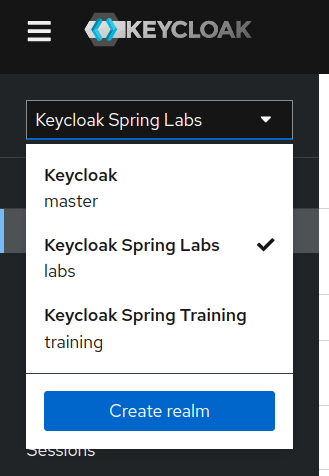
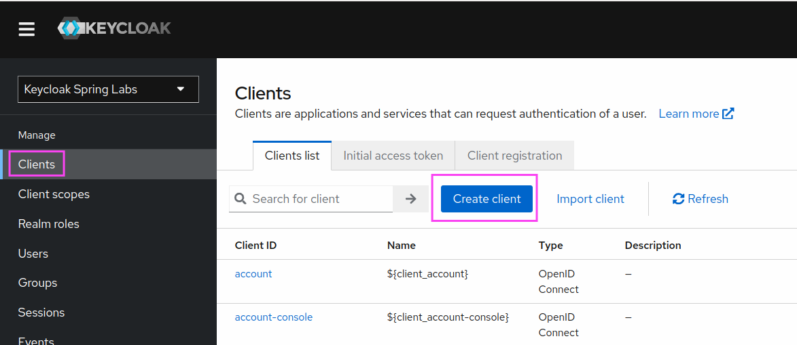
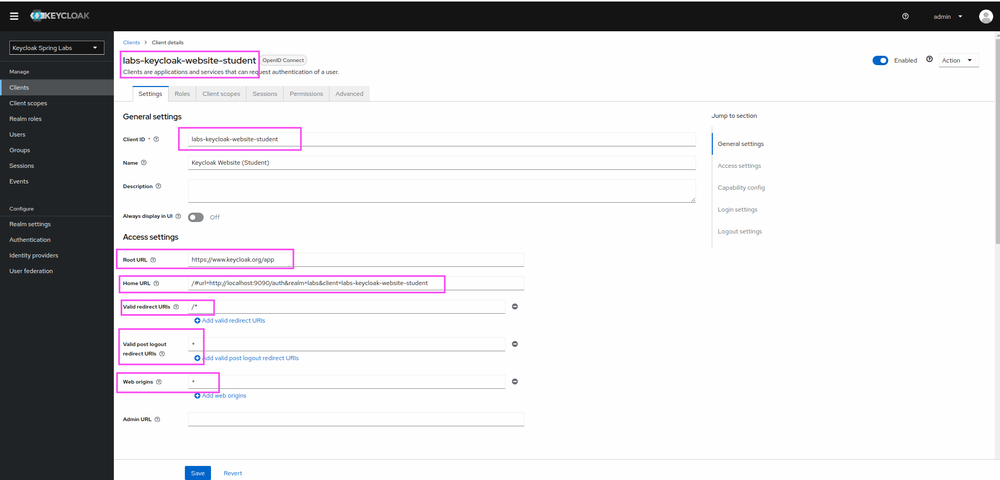
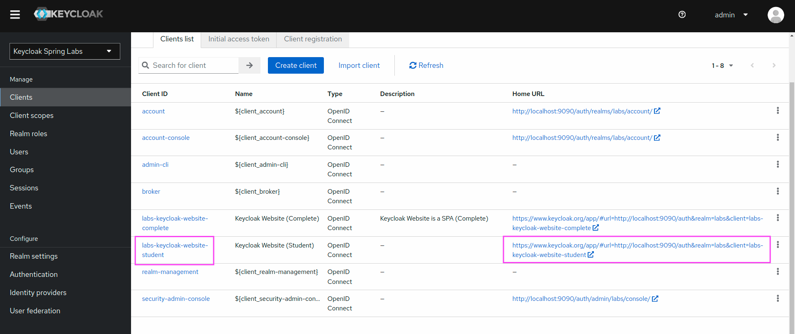
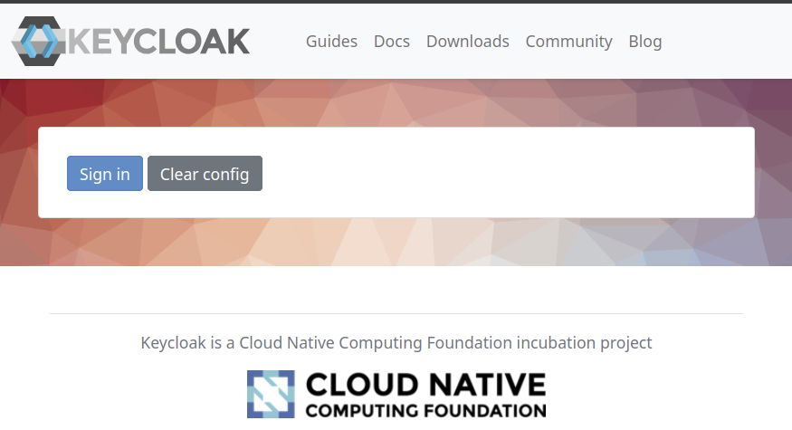
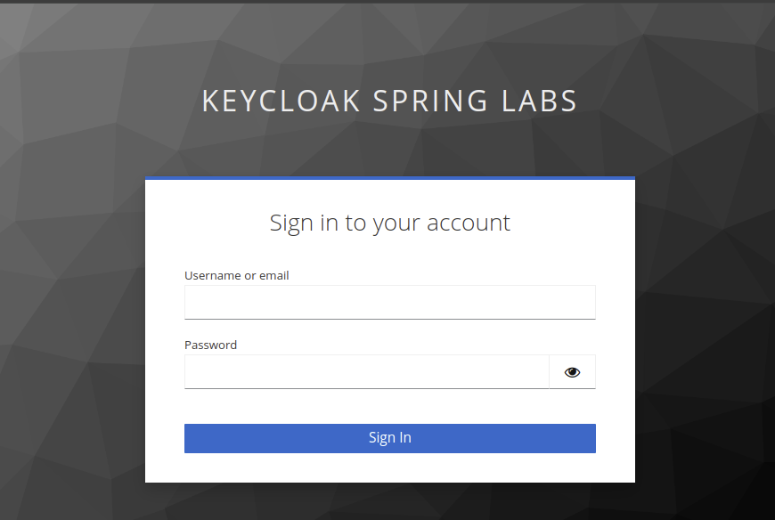
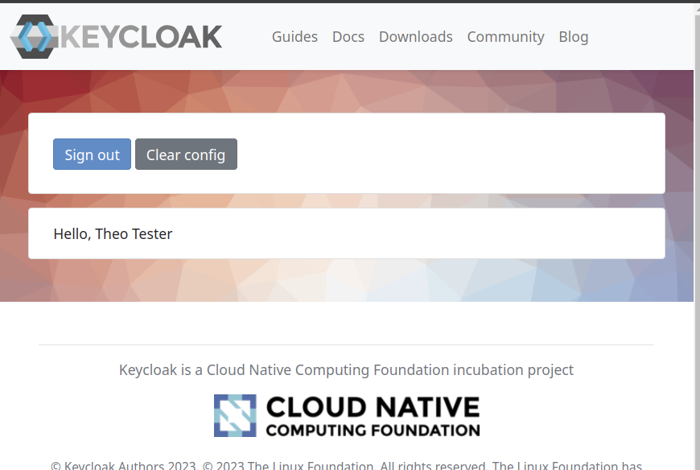

Lab 101: Configure Keycloak Website as Client
----

In this lab we want to register the keycloak test app provided by the keycloak website under https://keycloak.org/app
as a local OpenID Connect client.

# Instructions

## Start Keycloak Environment
> Start Keycloak Environment unless running.  
> Run `java start.java` in the root of the project.

## Open Keycloak Admin UI

Keycloak Admin Console: http://localhost:9090/auth

Username: `admin`
Password: `admin`

## Select the Keycloak Spring Labs realm

Make sure that you select the "Labs" realm in the upper left corner.

## Register the Client

Select the "Clients" menu and click on "Create Client".

In the dialog enter the following information:

"General Settings" Form:
- Client type: OpenID Connect
- Client ID: `labs-keycloak-website-student`
- Name: `Keycloak Website (Student)`
- Click "Next"

"Capability Config" Form:
- Client Authentication: Off
- Authentication Flow: Ensure only "Standard Flow" is selected
- Click "Next"

"Login Settings" Form:
- Root URL: `https://www.keycloak.org/app`
- Home URL: `/#url=http://localhost:9090/auth&realm=labs&client=labs-keycloak-website-student`
- Valid redirect URIs: `/*`
- Valid post Logout redirect URIs: `+`
- Web Origins: `+`
- Click "Next"

Client Configuration should look like that now:

# Login to Client

Go back to the Clients list

Open the Link in the Column "Home URL" for the `labs-keycloak-website-student` Client in an new private/incognito browser.

You should now see the following screen:

Click on `Sign in` and use the following credentials to authenticate:

Username: `user`
Password: `user`

You should now see the following screen:

Click "Sign out" to logout again.

# Summary

Congratulations you secured your first Web Application with Keycloak!
