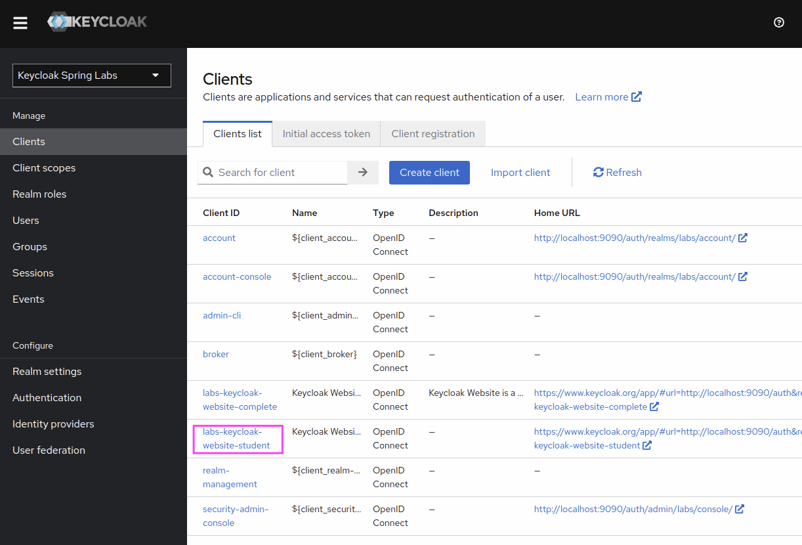
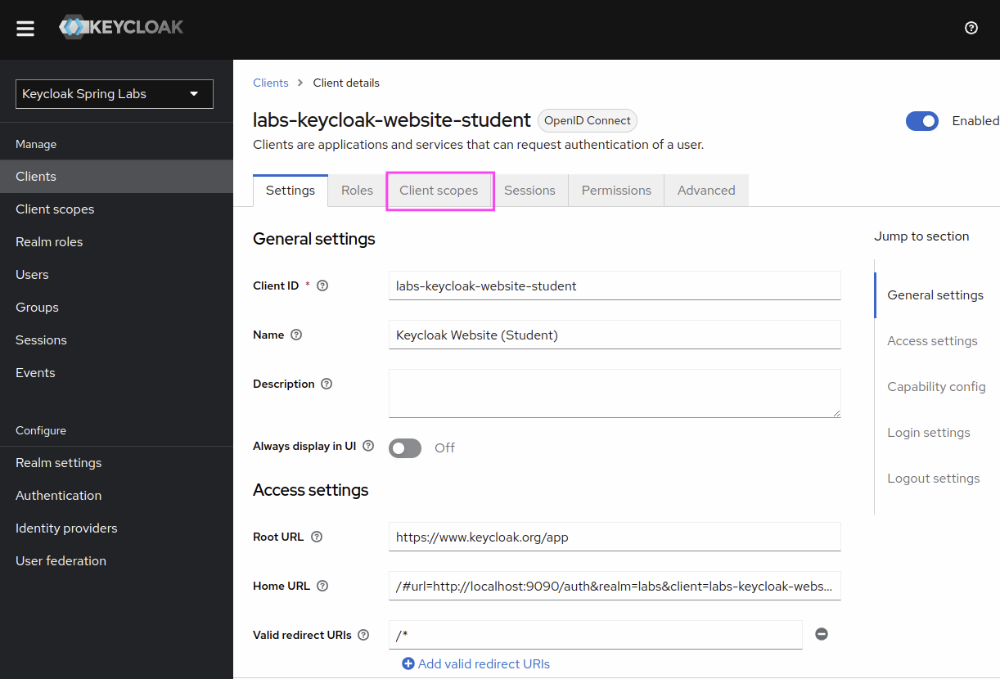
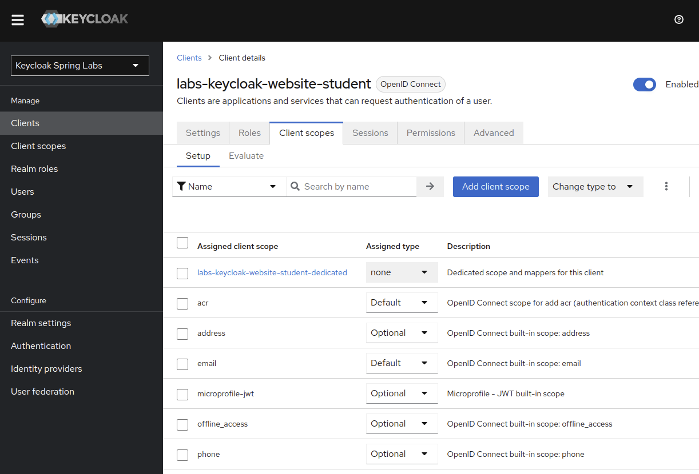
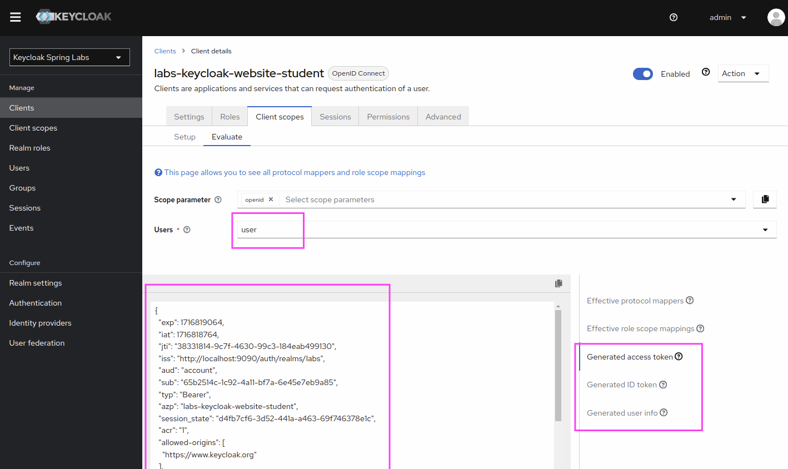

Lab 102: Inspect Token for Keycloak Website Client
----

In this lab we want to look at the token contents generated by keycloak for the labs-keycloak-website-student client.

# Instructions

## Start Keycloak Environment
> Start Keycloak Environment unless running.  
> Run `java start.java` in the root of the project.

## Open Keycloak Admin UI

Keycloak Admin Console: http://localhost:9090/auth

Username: `admin`
Password: `admin`

## Select the Keycloak Spring Labs realm

Make sure that you select the "Labs" realm in the upper left corner.

## Select the `labs-keycloak-website-student` Client 

## Open Client Scopes in the Client Details

## Click on Evaluate Tab

Then select evaluate and enter the username `user`.

You can now generate the content for an Access Token, ID Token and UserInfo.

# Summary

Congratulations you now know how to inspect token contents for a client with the Keycloak Admin Console.
