Lab 103: Customize Keycloak Website Token
----

In this lab we want to add a custom claim to the the token contents generated by keycloak for the `labs-keycloak-website-student` client.

# Instructions

## Start Keycloak Environment
> Start Keycloak Environment unless running.  
> Run `java start.java` in the root of the project.

## Open Keycloak Admin UI

Keycloak Admin Console: http://localhost:9090/auth

Username: `admin`
Password: `admin`

## Select the Keycloak Spring Labs realm

Make sure that you select the "Labs" realm in the upper left corner.

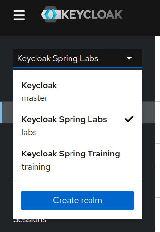

## Select the `labs-keycloak-website-student` Client 

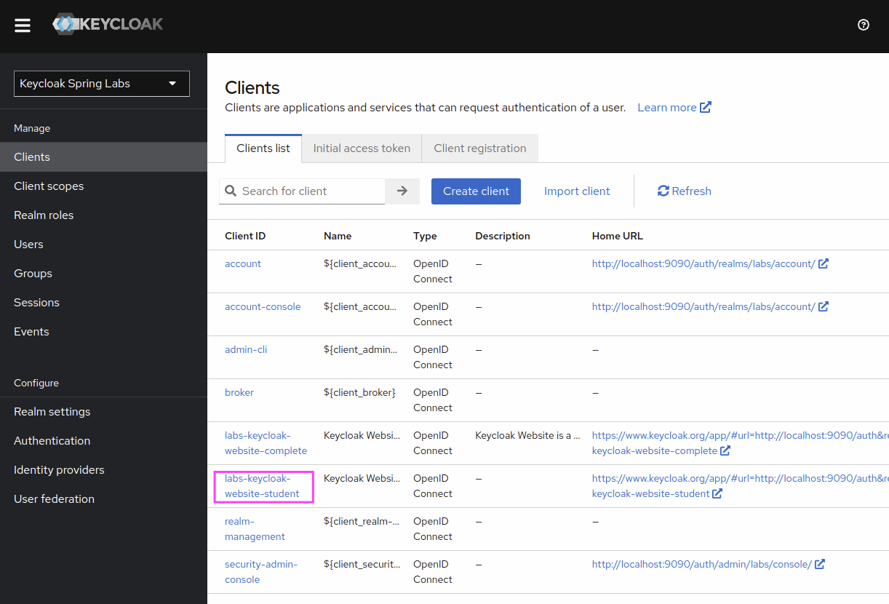

## Open Client Scopes in the Client Details

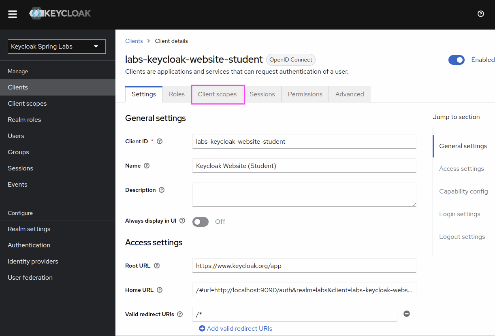

## Add dedicated Protocol Mapper to Client 

Click on "labs-keycloak-website-student-dedicated".

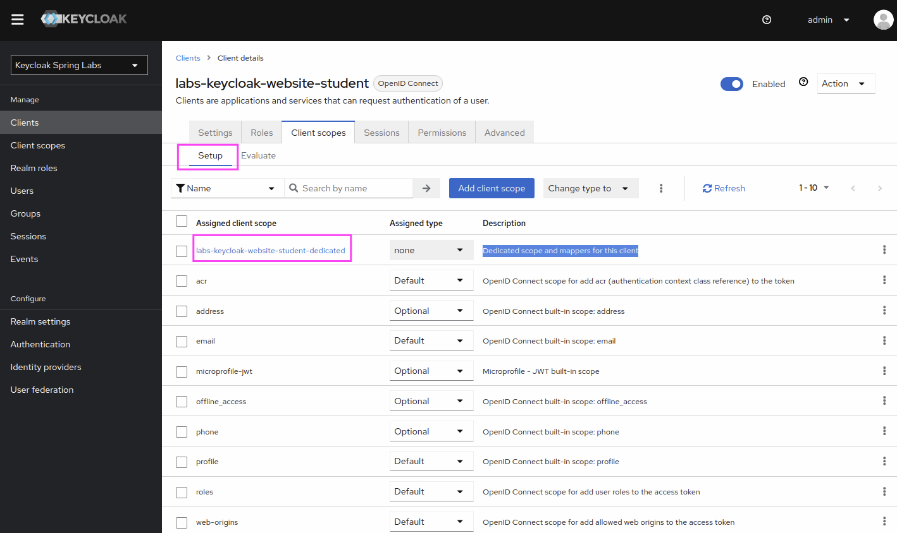

Then click "Configure new Mapper".

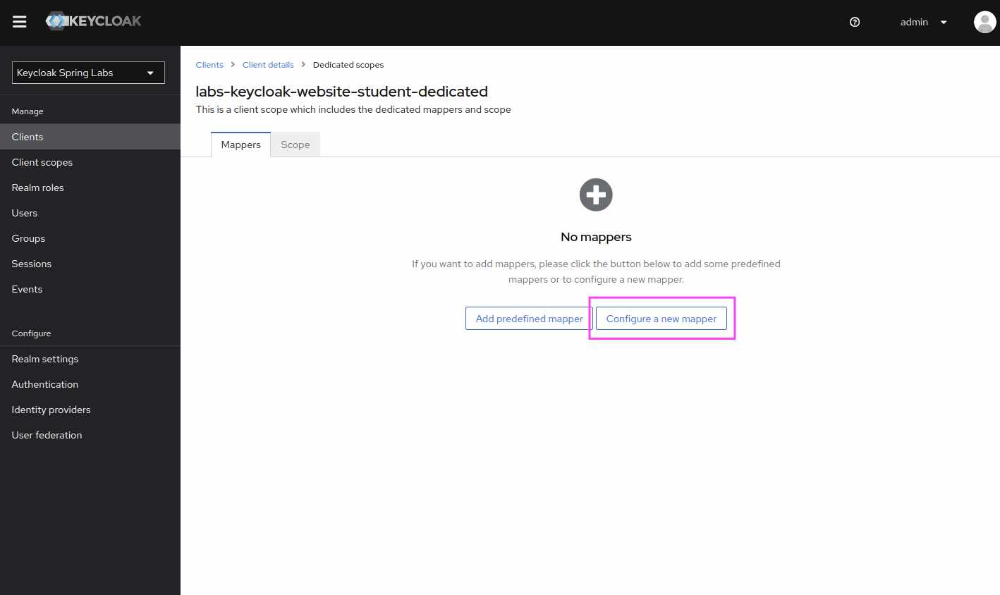

Select "Hardcoded Claim"

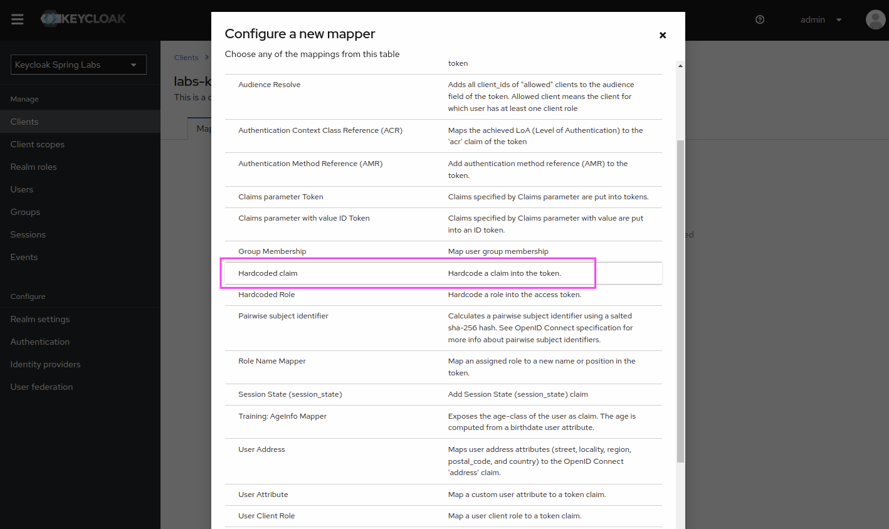

Then enter the following information:

- Mapper Name: `conference`
- Token Claim Name: `conference`
- Claim Value: `Spring I/O 2024`
- Click Save

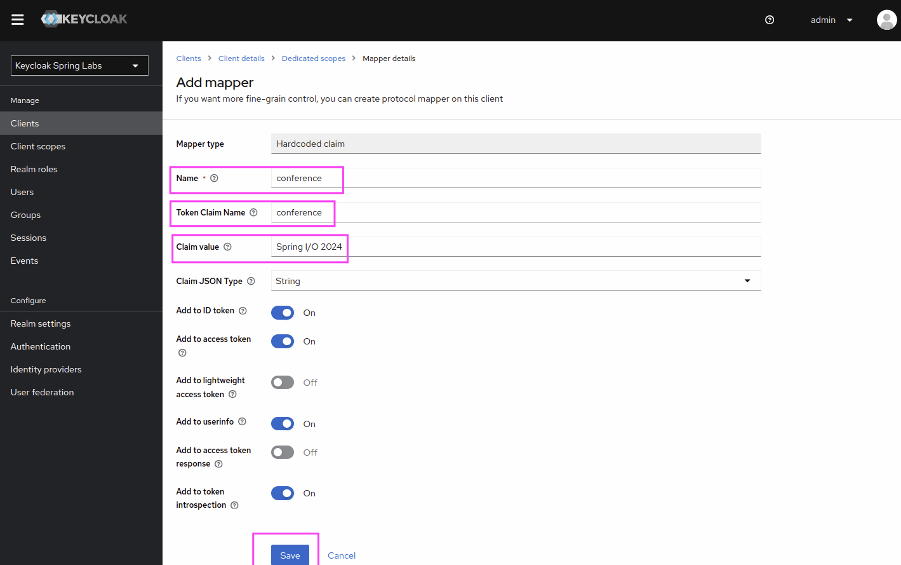

Now go back to the Client Scopes Configuration for this Client.

## Click on Evaluate Tab

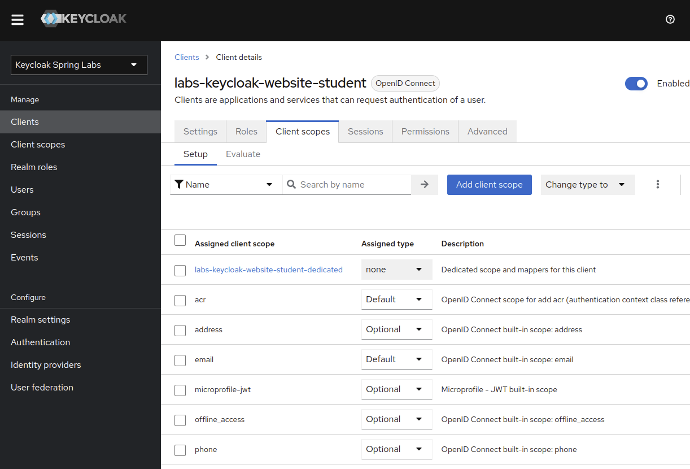

Then select evaluate and enter the username `user`.

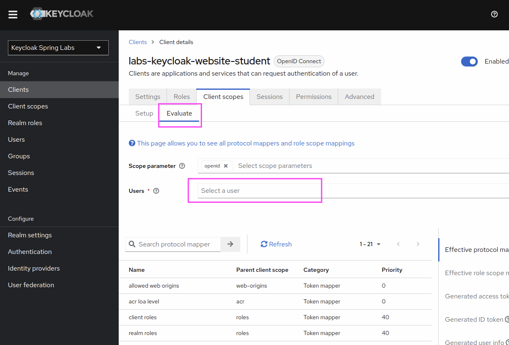

You can now generate the content for an Access Token, ID Token and UserInfo.

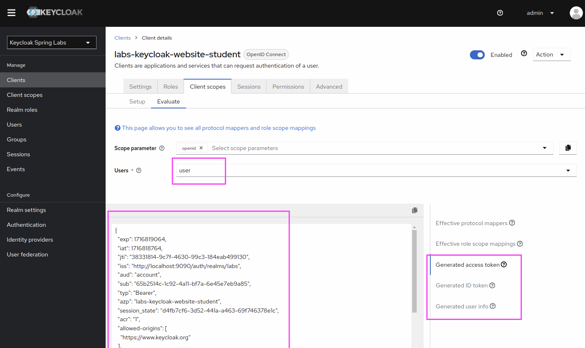

See that the access token now contains our custom `conference` claim.

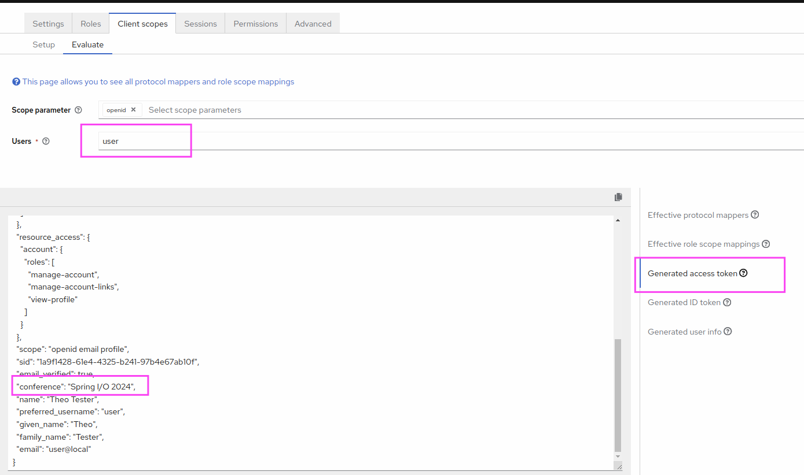

# Summary

Congratulations you now know how to customize token contents for a client with the Keycloak Admin Console.
