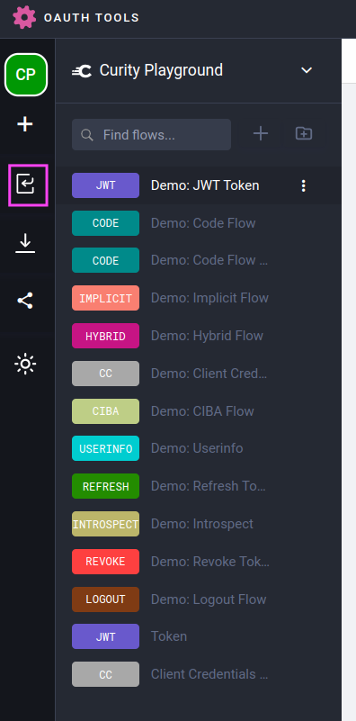
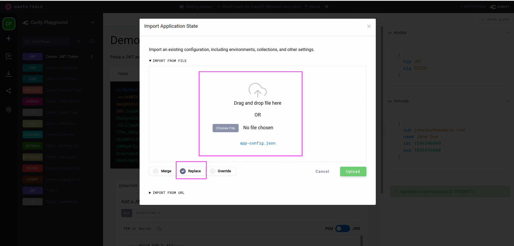
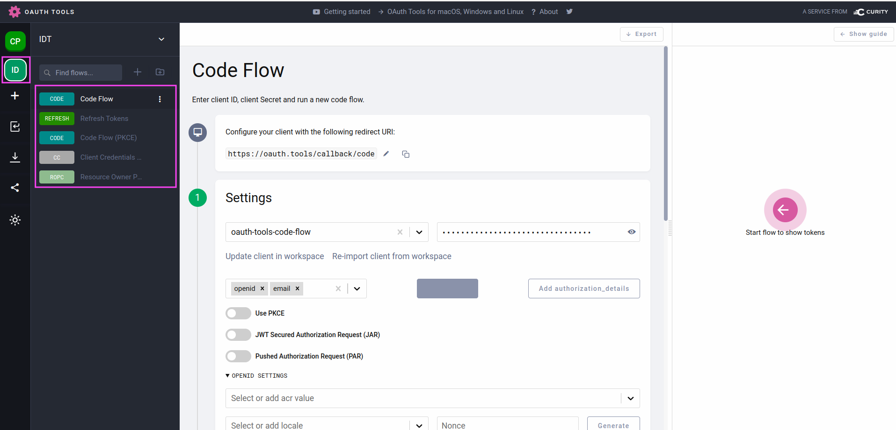

Lab 201: Simulate OAuth Flows with OAuth.Tools
---

# Instructions

We can use a publicly available Keycloak System to test various OAuth / OIDC Flows.

> Public Keycloak Test instance
> Link: https://lemur-6.cloud-iam.com/auth/realms/idt-training/account/
> Username: demo
> Password: <Ask instructor>

Import the following configuration into [oauth.tools](https://oauth.tools).

> OAuth.Tools Workspace
> Import the oauth.tools workspace

1. Go to https://oauth.tools
1. Click on "import" in the left action icon menu
1. Select [oauth/tools/app-config.json](./oauth/tools/app-config.json)
1. Select "Replace"
1. Click "Upload"
1. Click on new "ID" icon to select the imported workspace

You can now use the example flows