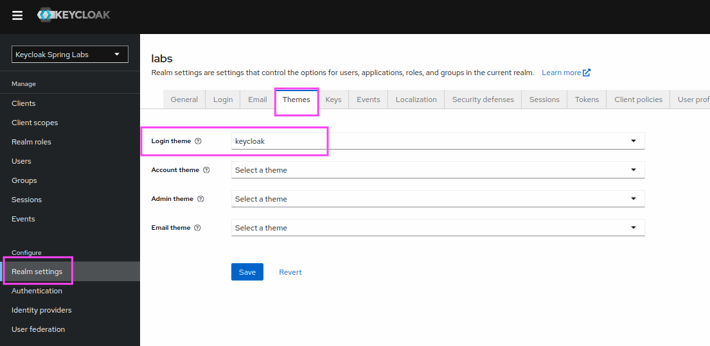
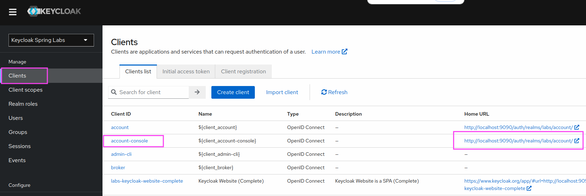
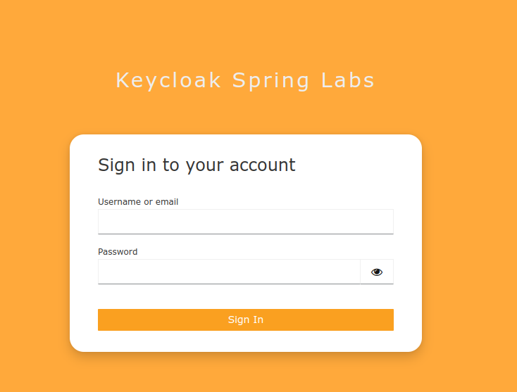
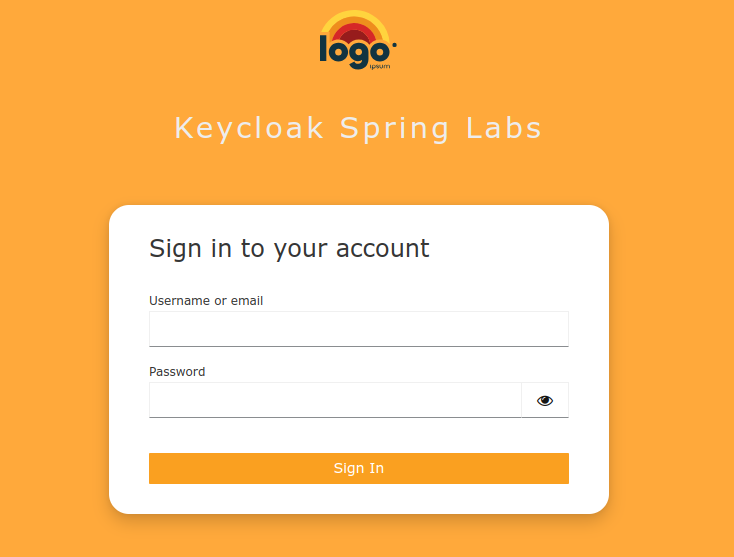

Lab 401: Customize Keycloak Login Theme
---

In this lab we want to customize the Keycloak login theme used by the `labs` realm (Keycloak Spring Labs).

# Instructions

Follow the instructions in this module marked with `//LABS:`.

## Add path to lab theme

See: [docker-compose-keycloak.yml](docker-compose-keycloak.yml) line: 61

## Restart Keycloak Environment
> Restart Keycloak Environment.  
> Run `java start.java` in the root of the project.

## Open Keycloak Admin UI

Keycloak Admin Console: http://localhost:9090/auth

Username: `admin`  
Password: `admin`

## Change Login Theme

In the realm settings go to "Themes".

Select the login theme "lab".

## Open Account Client

To see the selected login theme in action.  

Click on clients then search for the `account-console` client.  

Open the `Home URL` link for the `account-console` client in a private browser window: http://localhost:9090/auth/realms/labs/account

> Note the Home URL generation is broken in Keycloak 25.0.6, see [this issue](https://github.com/keycloak/keycloak/issues/31038#issuecomment-2369168729).

## Fix broken logo

The logo for our custom theme is not displayed fix the logo in [student/lab/login/resources/css/custom-login.css](student/lab/login/resources/css/custom-login.css).
> Note: Make sure to edit the CSS file beneath the student folder!

Reload the login page again.

# Summary

Congratulations, you learned how to customize the Keycloak login theme!