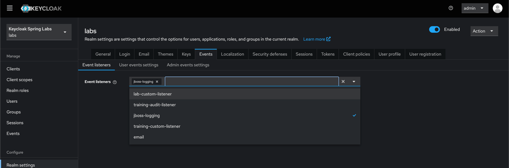

Lab 401: Create a Keycloak Extension
---

In this lab we want to extend Keycloak with a custom event listener.  
You can find more information on Keycloak extension development here: https://www.keycloak.org/docs/latest/server_development/index.html#_providers

# Instructions

Follow the instructions in this module marked with `//LABS:`.

## Add extensions.jar providers folder

See: [docker-compose-keycloak.yml](docker-compose-keycloak.yml) line: 64

## Build

Run the following command to build the extension.

```
mvn clean package
```

## Restart Keycloak Environment
> Restart Keycloak Environment.  
> Run `java start.java` in the root of the project.

# Verify

## Keycloak Server Log entries

The Keycloak server log should now show messages like the following: 
```
keycloak-1         | 2025-04-01 19:40:27,583 WARN  [org.key.services] (build-29) KC-SERVICES0047: lab-custom-listener (training.keycloak.labs.events.CustomLabsEventListener$Factory) is 
 implementing the internal SPI eventsListener. This SPI is internal and may change without notice
```

## Realm events config

The new event listener should now be available in the events listener configuration in the realm.

