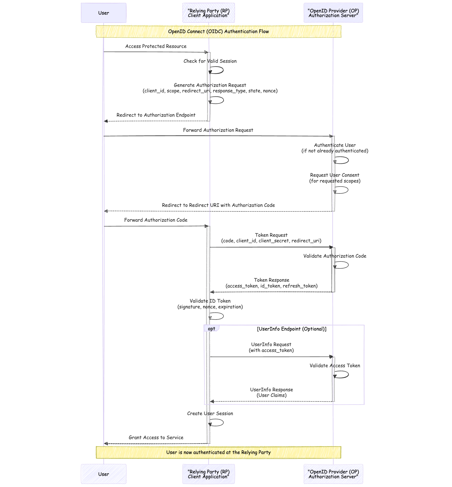
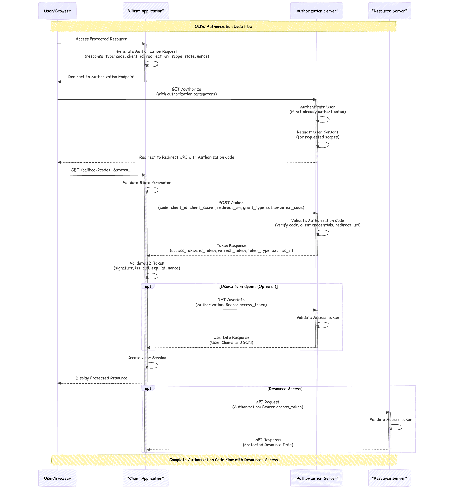
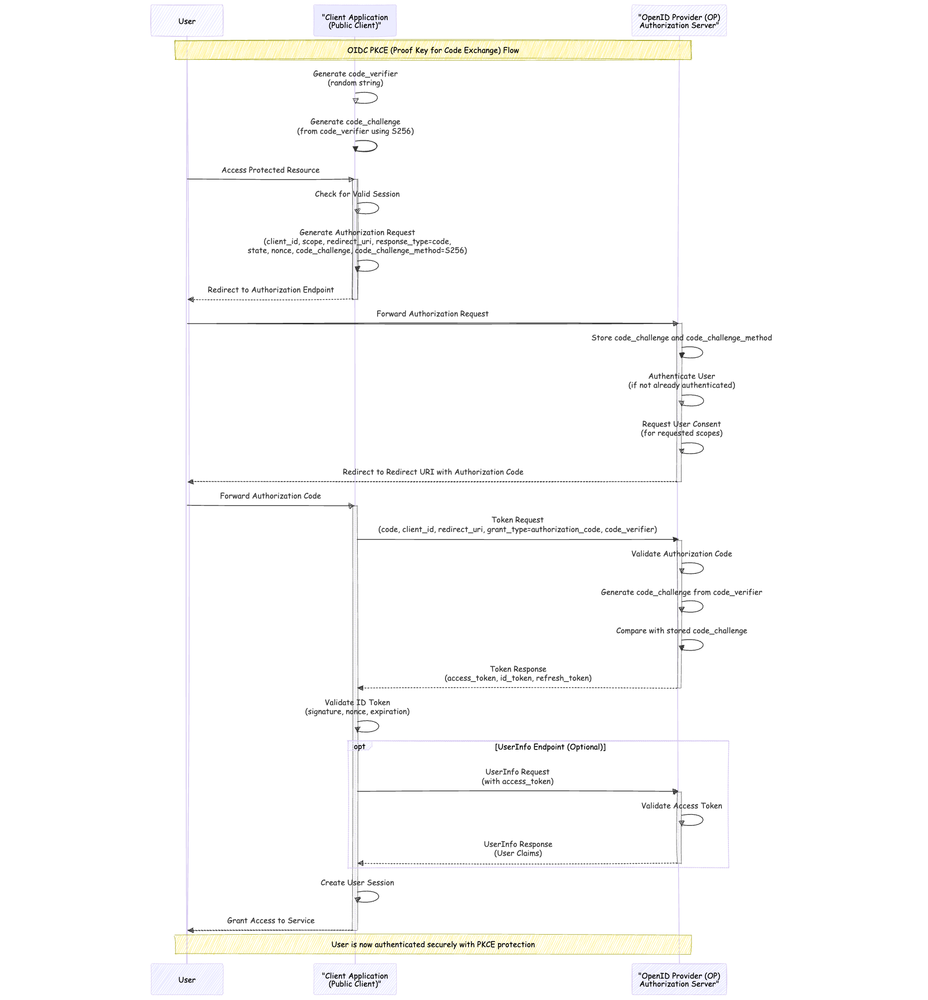
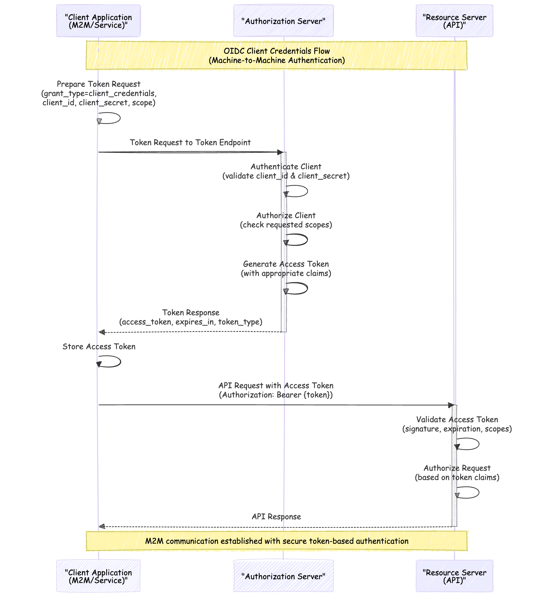
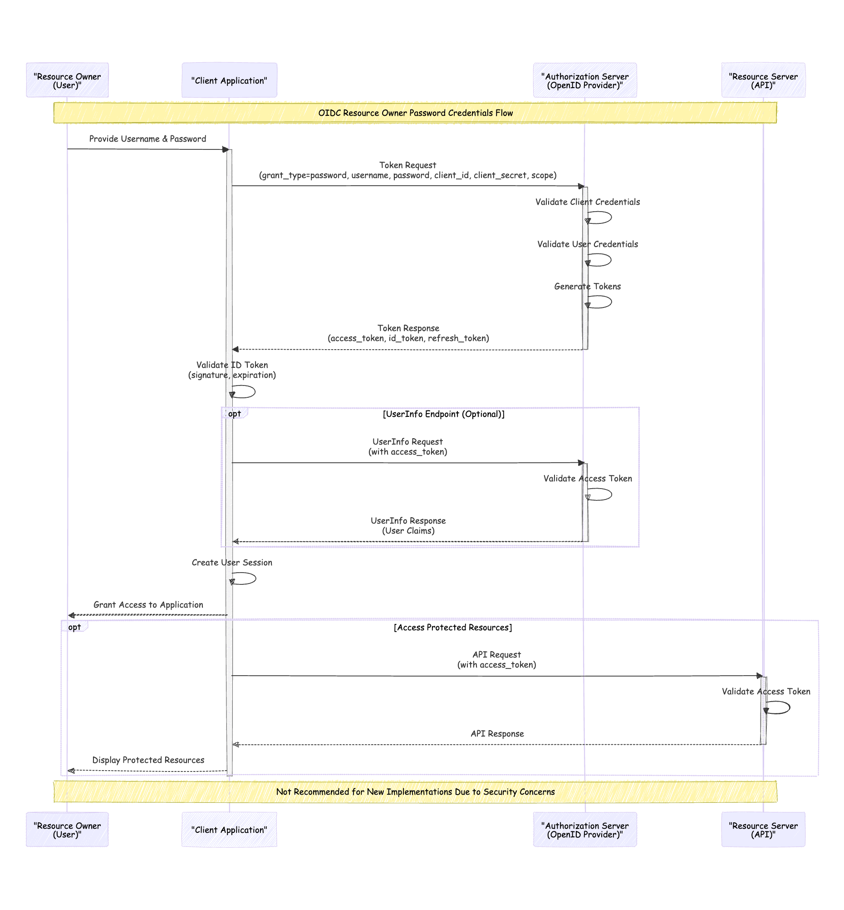
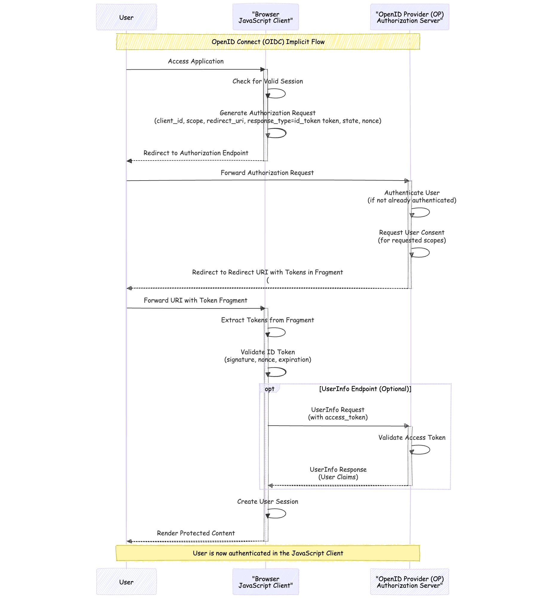

OpenID Connect Protocol Flows
---

OIDC Testing Tool: https://oidc-tester.compile7.org

# Standard OIDC Flow

# OIDC Authorization Code Flow

# OIDC Authorization Code Flow with PKCE

PKCE = Proof of Key Code Exchange

# OIDC Client Credentials Grant Flow

# Misc

## OAuth Resource Owner Password Credential Grant

## OIDC Implicit Flow

